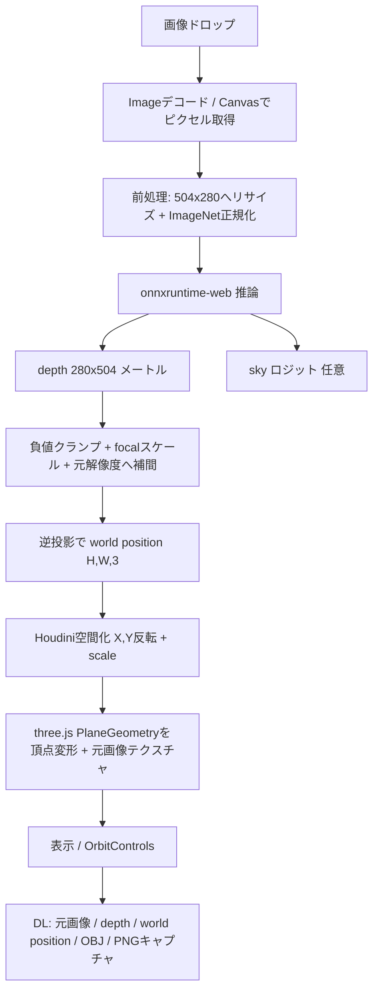

# Image to Mesh Web — 実装計画

単眼画像をブラウザにドロップするだけで、**ブラウザ内 (クライアントサイド) でデプス推定 → ワールドポジション化 → メッシュ表示**まで行う単体Webアプリ。GitHub Pages で静的ホスティングする。

> この文書は実装計画。実装を進めながら随時更新する。

---

## 1. ゴールと要件

### やること
- 画像 (JPG/PNG) をドラッグ＆ドロップ
- ブラウザ内で ONNX 推論 → メトリックデプス取得
- デプス → ワールドポジション (world position, WP) を計算
- WP をメッシュとして three.js で表示 (元画像をテクスチャに)
- 元画像 / デプス / WP をダウンロード可能に
- GitHub Pages でホストできる完全静的な単体Webアプリ
- 必要なら GitHub Actions で Pages 自動デプロイ

### 参照元 (`C:\work\script\Image_to_Mesh`) からの流用範囲
`run.bat` のエントリで使う機能**のみ**を移植する。以下は **不要 / 無視**:
- COLMAP エクスポート (`colmap_export.py`, `run_colmap.bat`)
- GLB点群出力 (`run_da3.bat`, `viewer_gltf/`)
- オクルージョン処理 (`occlusion_processor.py`)
- パディングツール (`padding/`)
- 2回実行 high-res モード、複数画像バッチの連続性推定 (単一画像で十分)

流用するロジック (Python → JS へ移植):
| 参照元 | 役割 | 移植先 |
|---|---|---|
| `modules/camera_utils.py` `screen_to_camera` | 逆投影 (u,v,depth)→カメラ座標 | `js/worldpos.js` |
| `modules/camera_utils.py` `convert_to_houdini_space` | X,Y 反転で Houdini (Y-up) 化 | `js/worldpos.js` |
| `modules/world_position.py` `_calculate_metric_depth` | `focal/300` スケール | `js/worldpos.js` |
| `viewer/index.html` + `viewer/js/main.js` | three.js メッシュ表示・OBJ/PNG出力 | `js/viewer.js` + `index.html` |

単一画像なので extrinsics は単位行列 (カメラ原点・回転なし) とみなし `camera_to_world` は恒等。

---

## 2. 使用モデルの仕様 (調査結果)

モデル: `DA3METRIC-LARGE.onnx`
出典: https://huggingface.co/TillBeemelmanns/Depth-Anything-V3-ONNX

| 項目 | 値 |
|---|---|
| 入力名/形状 | `[1, 3, 280, 504]` (B, C, H, W) **固定** |
| 入力型 | float32, 値域 [0,1] を ImageNet mean/std で正規化 |
| 出力 `depth` | `[1, 1, 280, 504]` メートル単位のメトリックデプス |
| 出力 `sky` | `[1, 1, 280, 504]` 空判定ロジット (小さいほど空) |
| カメラパラメータ | **出力しない** → intrinsics は別途推定/指定が必要 |

ImageNet 正規化: mean = `[0.485, 0.456, 0.406]`, std = `[0.229, 0.224, 0.225]`

後処理 (ROS2 TensorRT 実装に準拠):
1. デプス抽出、負値を 0 にクランプ
2. focal length スケール: `scale = (fx+fy)/2 / 300.0`（モデル内部の焦点正規化を実カメラに合わせる。参照元 `_calculate_metric_depth` と同一思想）
3. (任意) sky 処理: 空ピクセルを遠距離にキャップ
4. デプスを元画像解像度へ補間アップスケール
5. 逆投影で点群/WP 生成: `X=(u-cx)*Z/fx, Y=(v-cy)*Z/fy, Z=depth`

### カメラ intrinsics の扱い（重要な設計判断）
モデルは intrinsics を出さないため、以下のいずれかで `fx, fy, cx, cy` を決める:
- **既定**: 視野角 (FOV) を仮定して算出。`fx = fy = 0.5 * W / tan(FOV/2)`, `cx = W/2, cy = H/2`（既定 FOV = 60°）
- **UIで調整可**: FOV スライダー（35〜90°程度）でユーザーが補正
- 入力画像 EXIF に焦点距離があれば利用（オプション・後回し）

`scale = (fx+fy)/2 / 300` の focal スケールはこの推定 intrinsics に基づき適用する。

---

## 3. 技術スタック

| 領域 | 採用 | 備考 |
|---|---|---|
| 推論 | onnxruntime-web | CDN (jsDelivr) から読込。EP は WebGPU 優先 → WASM フォールバック |
| 3D表示 | three.js (r注: 参照元と同系統) | CDN 読込。`OrbitControls` 使用 |
| モデル配信 | HuggingFace CDN から実行時 fetch | `https://huggingface.co/TillBeemelmanns/Depth-Anything-V3-ONNX/resolve/main/DA3METRIC-LARGE.onnx` |
| モデルキャッシュ | Cache Storage / IndexedDB | 初回のみDL、2回目以降は高速化 |
| ホスティング | GitHub Pages (静的) | ビルド不要のバニラ構成 |

理由:
- **ビルドレス**: GitHub Pages にそのまま置ける純粋な HTML/JS/CSS。
- **モデルを repo に置かない**: LARGE モデルは大きく Pages のファイル上限/容量に不利。HF CDN は CORS 許可があり実行時取得が可能。初回DL後は Cache API で永続化。

> リスク: モデルサイズが大きい場合、初回ロードが重い。進捗バー表示と Cache 永続化で緩和。サイズ次第では量子化版や別ホスティングを検討（オープン課題）。

---

## 4. ディレクトリ構成（新規 `Image_to_Mesh_web`）

```
Image_to_Mesh_web/
├── index.html                 # UI (ドロップゾーン, コントロール, キャンバス)
├── css/
│   └── style.css              # 参照元 viewer のスタイルを流用・整理
├── js/
│   ├── main.js                # 全体オーケストレーション, ドロップ処理, UI配線
│   ├── inference.js           # onnxruntime-web: モデル読込/前処理/推論/後処理
│   ├── worldpos.js            # depth → world position (逆投影 + Houdini化 + scale)
│   ├── viewer.js              # three.js メッシュビューア (参照 main.js を移植)
│   ├── exr.js                 # 最小 EXR エンコーダ (FLOAT, 無圧縮) for DL
│   └── download.js            # 各種ファイルDLヘルパ
├── .github/
│   └── workflows/
│       └── deploy.yml         # GitHub Pages 自動デプロイ
├── .nojekyll                  # Jekyll 処理を無効化
└── README.md
```

---

## 5. 処理フロー



---

## 6. 主要モジュール設計

### 6.1 `inference.js`
- `loadModel(onProgress)`: HF からモデル取得（fetch + 進捗）→ Cache 保存 → `ort.InferenceSession.create` (WebGPU→WASM)
- `preprocess(imageData, W=504, H=280)`: リサイズ（オフスクリーンCanvas）→ `[0,1]` → ImageNet 正規化 → NCHW Float32Array
- `runInference(session, inputTensor)`: `depth`, `sky` 取得
- 出力を `{depth: Float32Array(280*504), width:504, height:280, sky?}` で返す

### 6.2 `worldpos.js`
- `estimateIntrinsics(width, height, fovDeg)`: `fx,fy,cx,cy`
- `computeWorldPosition(depth, dW, dH, intr, opts)`:
  1. 負値クランプ
  2. `metricDepth = depth * ((fx+fy)/2 / 300)`（focalスケール。`useMetricScale` で切替）
  3. 逆投影 `X=(u-cx)Z/fx, Y=(v-cy)Z/fy, Z=Z`
  4. Houdini化: `X=-X, Y=-Y`
  5. `* scale`
  - 戻り値: `Float32Array(H*W*4)` (RGBA=XYZ + 1) を返し viewer/EXRで共用
- 出力解像度は元画像解像度へ補間（viewer 側のバイリニアと整合）

### 6.3 `viewer.js`（参照 `viewer/js/main.js` を移植）
流用する機能:
- `PlaneGeometry` を WP で頂点変形、元画像をテクスチャ
- 表示モード: ソリッド / ワイヤーフレーム / ポイント（点サイズ調整）
- ライティング ON/OFF、カラー ON/OFF
- `resetView`、`OrbitControls`
- `exportAsOBJ`（UV付き）、`exportAsPNG`（2048キャプチャ）

参照元との差分:
- ファイルドロップで WP/EXR を読むのではなく、**推論結果の WP を直接受け取る** API (`viewer.setData(worldPos, colorTexture)`) に変更

### 6.4 `exr.js`
- `encodeEXR(channels, width, height)`: 無圧縮スキャンライン・FLOAT(32bit) EXR を生成
  - depth: 単一 `Y` チャンネル
  - world position: `R=X, G=Y, B=Z`（参照元 `write_worldpos_exr` と同じチャンネル割当）
- Houdini 等の後工程互換を維持

### 6.5 `download.js` / DL 機能
ダウンロードボタン:
- **元画像** (`{name}.png` / 元拡張子のまま)
- **デプス**: `{name}_depth.exr`（FLOAT）＋ 確認用に `{name}_depth.png`（正規化16bit/8bitカラーマップ）
- **ワールドポジション**: `{name}_worldposition.exr`（R=X,G=Y,B=Z）
- **OBJ** メッシュ（viewer 既存機能）
- **PNG** ビューキャプチャ（viewer 既存機能）

---

## 7. UI 仕様
- 中央にドロップゾーン（参照 viewer のデザイン流用）。クリックでファイル選択も可
- 右上コントロールパネル:
  - FOV スライダー（intrinsics 推定用）＋再計算
  - scale スライダー（ワールド座標スケール、既定 1.0）
  - metric focal スケール ON/OFF
  - 表示モード（ソリッド/ワイヤー/ポイント）、点サイズ
  - ライティング / カラー トグル
  - リセットビュー
  - ダウンロード群（画像 / depth / WP / OBJ / PNG）
- 左下に情報（解像度、XYZ 範囲）
- ローディングオーバーレイ（モデルDL進捗 / 推論中）

---

## 8. GitHub Pages デプロイ
- `.nojekyll` を置き Jekyll を無効化（`_` 始まりや特殊処理回避）
- `.github/workflows/deploy.yml`:
  - `main` への push で `actions/upload-pages-artifact` → `actions/deploy-pages`
  - ルート（リポジトリ全体 or `Image_to_Mesh_web/`）を公開
- Pages 設定: Source = GitHub Actions
- COOP/COEP に注意: onnxruntime-web の WASM スレッド/SIMD は cross-origin isolation が望ましいが、GitHub Pages はヘッダ設定不可。対策:
  - シングルスレッド WASM / WebGPU を既定にする、または
  - `coi-serviceworker` で擬似的に isolation を付与（オプション）

---

## 9. オープン課題 / 確認事項
1. **モデルサイズと初回ロード時間**: LARGE ONNX は数百MB規模の可能性。重い場合は量子化版や Git LFS/別CDN を検討。
2. **HF CDN の CORS**: `resolve/main/...` への直接 fetch が CORS で通るか実機確認。NG なら Pages 同梱 (Git LFS) かプロキシ。
3. **intrinsics の精度**: FOV 仮定では実寸が不正確。既定値と UI 調整で許容するか要確認。
4. **WebGPU 非対応ブラウザ**: WASM フォールバック時の速度（280x504 と小さいので許容見込み）。
5. **EXR を本当に使うか**: 後工程が Houdini なら EXR 必須。不要なら PNG/PLY で軽量化可。

---

## 10. 実装ステップ（チェックリスト）
- [ ] プロジェクト雛形作成（index.html, css, js 空ファイル, .nojekyll）
- [ ] three.js ビューア移植（`viewer.js`）— ドロップ非依存の `setData` API 化
- [ ] onnxruntime-web 組込み・モデルロード（進捗・キャッシュ）
- [ ] 前処理（リサイズ＋ImageNet正規化）
- [ ] 推論・後処理（クランプ・focalスケール・アップスケール）
- [ ] world position 計算（逆投影・Houdini化・scale）
- [ ] ビューアへ供給してメッシュ表示
- [ ] EXR エンコーダ実装（depth / WP）
- [ ] ダウンロード機能（画像 / depth / WP / OBJ / PNG）
- [ ] UI（FOV/scale/表示モード等）配線
- [ ] GitHub Actions デプロイ設定 + 動作確認
- [ ] README 整備
```
